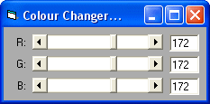

<div align="center">

## \[ RGB Form Colour Changer \]


</div>

### Description

This little code will allow you to change the forms colour using Scroll Bar and Text Boxes, this can be changed to change the colour of a Text Box, etc. Please vote and leave your comments :)
 
### More Info
 
Three Scroll Bars named: hsbRed, hsbGreen, and hsbBlue. Also three Text Boxes named: txtRed, txtGreen, and txtBlue.


<span>             |<span>
---                |---
**Submitted On**   |
**By**             |[JamesJD](https://github.com/Planet-Source-Code/PSCIndex/blob/master/ByAuthor/jamesjd.md)
**Level**          |Beginner
**User Rating**    |4.7 (14 globes from 3 users)
**Compatibility**  |VB 3\.0, VB 4\.0 \(16\-bit\), VB 4\.0 \(32\-bit\), VB 5\.0, VB 6\.0
**Category**       |[Custom Controls/ Forms/  Menus](https://github.com/Planet-Source-Code/PSCIndex/blob/master/ByCategory/custom-controls-forms-menus__1-4.md)
**World**          |[Visual Basic](https://github.com/Planet-Source-Code/PSCIndex/blob/master/ByWorld/visual-basic.md)
**Archive File**   |[](https://github.com/Planet-Source-Code/jamesjd-rgb-form-colour-changer__1-48392/archive/master.zip)


### Source Code

```
Private Sub Form_Load()
  hsbRed.Value = 255
  hsbGreen.Value = 255
  hsbBlue.Value = 255
End Sub
Private Sub hsbBlue_Change()
  Form1.BackColor = RGB(hsbRed.Value, hsbGreen.Value, hsbBlue.Value)
  txtBlue.Text = hsbBlue.Value
End Sub
Private Sub hsbGreen_Change()
  Form1.BackColor = RGB(hsbRed.Value, hsbGreen.Value, hsbBlue.Value)
  txtGreen.Text = hsbGreen.Value
End Sub
Private Sub hsbRed_Change()
  Form1.BackColor = RGB(hsbRed.Value, hsbGreen.Value, hsbBlue.Value)
  txtRed.Text = hsbRed.Value
End Sub
Private Sub txtBlue_Change()
  hsbBlue.Value = txtBlue.Text
End Sub
Private Sub txtGreen_Change()
  hsbGreen.Value = txtGreen.Text
End Sub
Private Sub txtRed_Change()
  hsbRed.Value = txtRed.Text
End Sub
```

